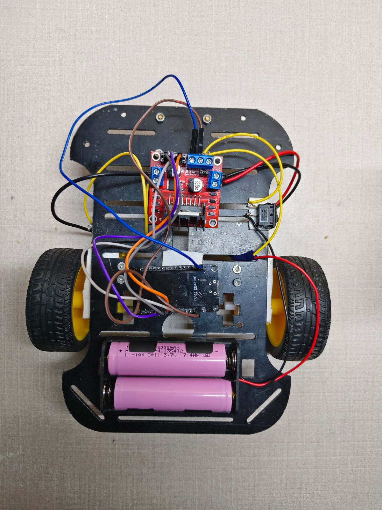
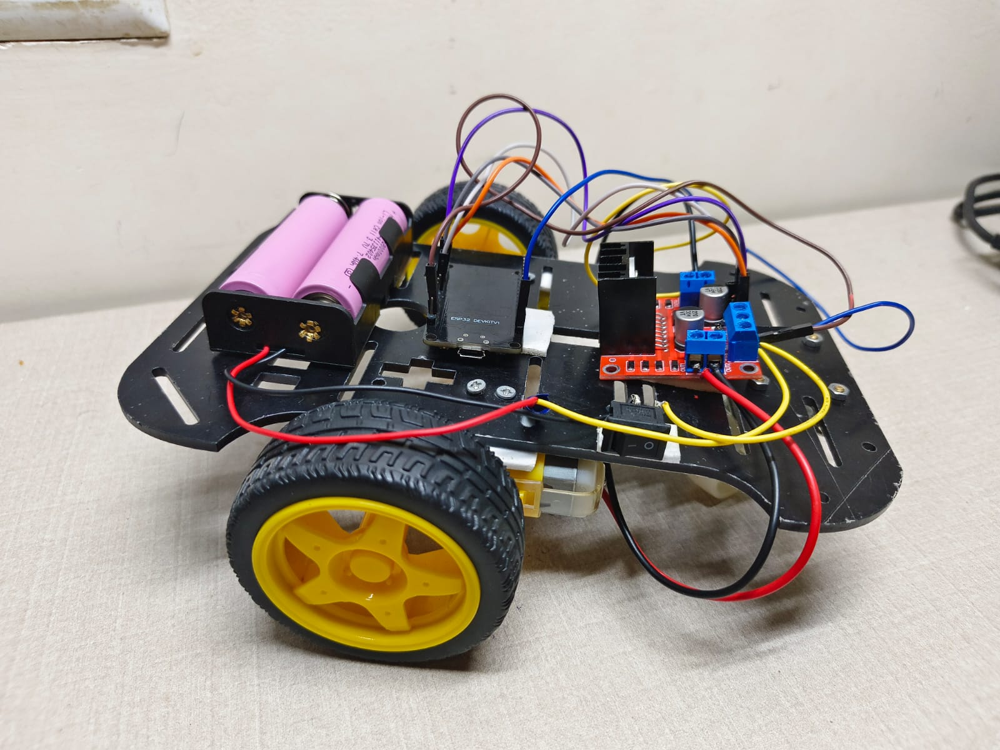
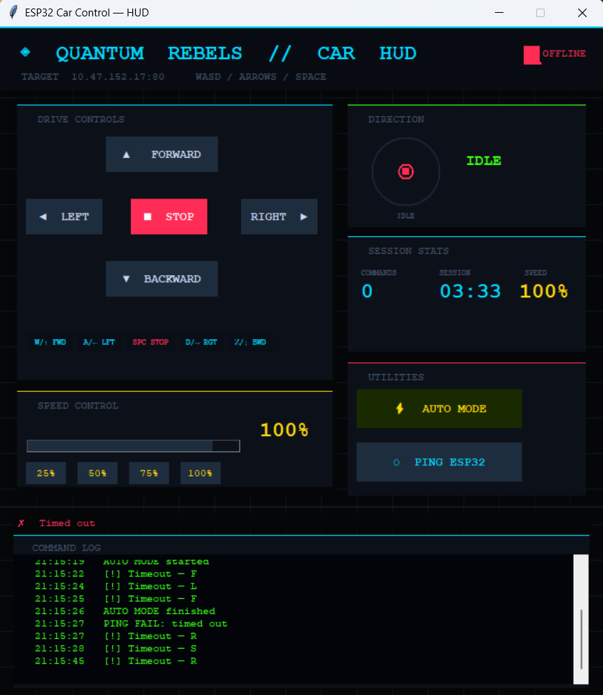
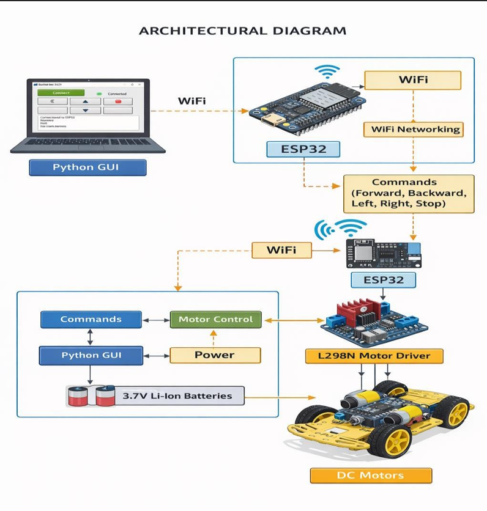

# 🤖 Python-Based Wireless Robot Control System using ESP32

A wireless robotic vehicle controlled through a custom Python Tkinter graphical user interface (GUI). The system establishes communication between a desktop application and an ESP32 microcontroller using socket programming, enabling real-time wireless control of the robot.

---

# 📖 Project Overview

This project combines concepts from:

- Python Programming
- Tkinter GUI Development
- Socket Programming
- ESP32 Programming
- Embedded Systems
- Robotics
- Wireless Communication

The user controls the robot through a desktop application developed using Python. The GUI sends commands wirelessly to the ESP32, which interprets those commands and drives the robot accordingly.

---

# 🎯 Objective

To develop a low-cost wireless robotic system that can be remotely controlled through a Python-based graphical interface while demonstrating practical implementation of IoT, networking, and embedded systems.

---

# 🔧 Hardware Components Used

| Component | Purpose |
|------------|------------|
| ESP32 | Main Microcontroller |
| Robot Chassis | Robot Platform |
| DC Motors | Robot Movement |
| Motor Driver Module | Motor Control |
| Wheels | Mobility |
| Battery Pack | Power Supply |
| Jumper Wires | Circuit Connections |

---

# 💻 Software Technologies Used

| Technology | Purpose |
|------------|------------|
| Python | GUI Development |
| Tkinter | User Interface |
| Socket Programming | Wireless Communication |
| Arduino IDE | ESP32 Programming |
| GitHub | Project Documentation |

---

# ✨ Features

- Wireless Robot Control
- Custom Python GUI
- Forward Movement
- Backward Movement
- Left Turn
- Right Turn
- Stop Function
- Real-Time Socket Communication
- Wi-Fi Based Control
- User Friendly Interface

---

# 🏗️ System Architecture

```text
User
   ↓
Python Tkinter GUI
   ↓
Socket Communication
   ↓
Wi-Fi Network
   ↓
ESP32
   ↓
Motor Driver
   ↓
Robot Car
```

---

# 🔄 Working Principle

1. User opens the Python GUI application.
2. Direction buttons are displayed using Tkinter.
3. User clicks a movement button.
4. Python sends the command using socket communication.
5. ESP32 receives the wireless command.
6. ESP32 processes the instruction.
7. Motors are activated and the robot moves accordingly.

---

# 📸 Hardware Top View



---

# 🔌 Hardware Side View



---

# 🖥️ Python Tkinter GUI

The robot is controlled through a custom desktop application developed using Python Tkinter.



---

# 🔄 Control Flow Diagram

The following diagram illustrates the communication flow between the user interface and the robotic system.



---

# 📂 Repository Structure

```text
python-wireless-robot-control-system
│
├── README.md
├── robot_controller.py
├── robot_car.ino
│
└── images
    ├── GUI.png
    ├── flow_diagram.png
    ├── hardware_sideview.jpeg
    └── hardware_topview.jpeg
```

---

# ⚠ Challenges Faced

- Establishing stable socket communication
- ESP32 Wi-Fi configuration
- Synchronizing GUI commands with hardware
- Debugging wireless connectivity
- Hardware assembly and testing

---

# 🚀 Future Improvements

- Mobile Application Control
- Live Camera Streaming
- Obstacle Detection
- Autonomous Navigation
- Voice Command Support
- ROS Integration
- AI-Based Path Planning

---

# 📈 Results

The project successfully established wireless communication between a Python desktop application and an ESP32-based robotic vehicle. Commands were transmitted in real time, enabling smooth remote control through a custom graphical interface.

This project demonstrates the integration of software development, embedded systems, and robotics into a single practical application.

---

# 👨‍💻 Developer

**Rutansh Panchal**

Electronics Engineering Student

Areas of Interest:

- Embedded Systems
- Robotics
- IoT Development
- Python Programming
- ESP32 Projects
- Artificial Intelligence
- Electronics Product Design

---

⭐ If you found this project interesting, consider giving it a star.
